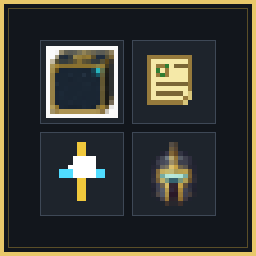

<div align="center">



# God of Things（万物之神）

**一个面向 Minecraft 1.21.1 + NeoForge 的集合型功能模组，全部内容为原创。**

*神之熔炉、神之矿机、天神附魔、神之工具…… 一整套「神之」工具与机器。*

[](https://github.com/ZeoNG129/Godofthings/actions/workflows/build.yml)


[](LICENSE.txt)

**[下载](https://github.com/ZeoNG129/Godofthings/releases)** ·
[内容一览](#内容一览) ·
[快速开始](#快速开始) ·
[环境要求](#环境要求) ·
[构建](#构建) ·
[测试](#测试) ·
[指令](#指令) ·
[版本号](#版本号) ·
[键位](#键位) ·
[目录结构](#目录结构) ·
[许可](#许可)

</div>


<a id="内容一览"></a>

## 🌸 内容一览

| 模块 | 说明 |
|------|------|
| 🔥 神之熔炉 God Furnace | 超级熔炉：**9 输入 + 9 输出**、六面 I/O 配置，可并网 **AE2**（产物自动进网络） |
| ⛏️ 神之矿机 God Miner | 范围挖掘机：效率 / 时运 / 精准采集可调，六面 I/O，掉落吃神之共鸣 |
| 💎 神之矿物 God Ore Machine | 只收矿物：原矿 / 锭 / 宝石 / 矿石块（含模组矿石）→ 对应产物 **×64/轮** |
| 🌱 神之作物 God Crop Machine | 只收作物：一切植物按收获掉落或复制，**×64/轮** |
| ✨ 神之复制 God Duplicate | 收一切物品：任何东西复制 **×64/轮**（全新堆叠） |
| 🪵 神之去皮 God Peeler | 自动去皮：原木 → 去皮原木（原版 11 组 + 模组惯例自动识别），9+9 槽，可并网 AE2 |
| 🎁 神之掉落机 God Drop | 按**原版战利品表**产出生物全部掉落；兼容全模组刷怪蛋 |
| 🥚 神之怪蛋 God Spawn Egg | 刷怪蛋复制机：同种蛋 **×64/轮**，实体数据保真 |
| 📜 神之附魔 God Enchant | 任意物品自选附魔与等级，最高 **255 级** |
| ⚡ 神之加速 God Accelerator | 机器并行加速：每个 **×16**，一组 64 个 = **×1024** |
| 🌦️ 神之改造 God Change | 时间 / 天气一键调控 |
| 📏 神之测量 God Measurement | 卷尺：两点画线框显三轴尺寸（纯客户端零开销） |
| ♾️ ME 无限存储元件 | 水 / 熔岩 / 圆石 / 空白样板 ×4：**21.4 亿**资源无限存取 |
| 🛠️ 神之合成 God Craft | 高级合成台：配置菜单 / 8 模板槽 / 均分输入 |
| 🛡️ 神之护甲 God Armor | 四件套：**8 功能开关** + 三页技能树（7 增幅 + 7 共鸣） |
| ❤️ 神之请神 God Invite | 右键生物赋予无限血量（可切换） |
| 🗑️ 神之吞噬 God Devourer | 虚空垃圾桶：方块 + 背包快捷按钮 |
| 🌀 传送点 Waypoints | U 键图形界面：编辑 / 置顶 / 导出备份，上限 256 |
| 🌍 无用维度 Useless Dimension | 照抄 useless_mod 的三个维度 + 可视化配置界面 |
| ⏳ 时空永恒 | 放置后锁定世界时间与天气 |
| 💥 生物覆灭 | 半径 512 格禁止生物自然生成 |
| 📦 神之黑盒 God Black Box | 拾取过滤存储：白 / 黑名单，无堆叠上限，滚轮开关 |
| 📡 神之传输 God Transmitter | 无线 FE 充能：机器 + 玩家，跨维度，四标签页 |
| 🔗 神之绑定 God Binding | 右键机器绑定到神之传输（副手放置自动绑定） |
| 📝 神之便签 God Note | 任务清单：子任务 / 拖拽排序 / 屏幕悬浮窗，按玩家存档 |
| ⚔️ 神之砍杀 God Slaughter | 范围击杀：开关 / 范围 / 抢夺 / 秒杀，27 格无限存储 |
| 🧲 神之吸收 God Absorber | 大范围吸收掉落物与经验，六面配置 |
| 🕳️ 维度 | 虚空维度 + 双向传送门方块 |
| 🧸 皮肤玩偶 HoYooG Fumo | 12 部件玩家模型玩偶：右键自转、可戴头上 |
| 🔋 创造能量立方 | 无限 FE 能量源（∞ FE/t 六面输出） |
| 🌐 AE2 并网 | 9 台产资源机器可作 AE2 网格节点（产物自动进网络，AE 开关可控） |
| 🏆 成就树 | **29 个成就**：机器线 / 套装线 / 便签线 / 维度线 |
| 📖 神之手册 God Manual | 游戏内手册：每个物品都有条目，`P` 键 / 物品右键 / 指令 |
| 🩺 诊断与备份 | `/godofthings doctor` 诊断；export / import 备份便签与传送点 |

> 📖 每个版本改了什么见 [VERSIONING.md](VERSIONING.md)；游戏内按 `P` 查神之手册。

<a id="快速开始"></a>

## 🚀 快速开始

1. 安装 **Minecraft 1.21.1 + NeoForge 21.1.249**；
2. 从 [Releases](https://github.com/ZeoNG129/Godofthings/releases) 下载 `godofthings-<版本>.jar`（**5.x 的全部 jar 都在 v5.1.7 那个 release 的 Assets 里**，按版本号取最新）；
3. 放进 `mods/` 目录。⚠ 运行期**必须有 AE2**（若干机器直接实现了 AE2 接口，缺依赖会在加载阶段报错退出）；
4. 进游戏按 `P` 打开神之手册，每个物品都有条目。

<a id="环境要求"></a>

## 🧭 环境要求

- **JDK 21**（Minecraft 1.21.1 / NeoForge 21.1 要求；本机路径示例：`E:\MC\java\java21`）
- NeoForge `21.1.249` + NeoGradle（ModDevGradle 2.0.x，由 wrapper 自动分发）
- 构建期首次需联网解析 Minecraft / NeoForge 依赖（已缓存则无需重复下载）；JEI / EMI / AE2 集成依赖已预下载到 `libs/`，构建无需联网

<a id="构建"></a>

## 🛠️ 构建

```powershell
# JDK 21 由 gradle.properties 的 org.gradle.java.home 指定，直接构建即可
.\gradlew build
# 产物：build\libs\godofthings-<mod_version>.jar（版本见 gradle.properties）
```

**构建成功后自动同步**：`build` 完成后 `deployJars` 任务会把 jar 自动复制到两个本机测试目录
（`E:\MC\modpacks\PCL\versions\1.21.1测试\mods` 与 `E:\MC\ALL\mods\自制\1.21.1`），
并清理旧版本号 jar（`keepOldVersions=false`）——改完代码 `gradlew build` 即可开游戏测试。

开发运行：

```powershell
.\gradlew runClient   # 启动开发客户端
.\gradlew runServer   # 启动开发服务端
.\gradlew runData     # 数据生成器（输出到 src/generated/resources）
```

**首次克隆先拉一次编译期依赖**：4 个第三方模组 jar（JEI ×2 / EMI / AE2，约 9MB）不再随源码分发，跑一次
`.\fetch-libs.ps1` 从本仓库的 `libs-1.21.1` release 拉回 `libs/`，之后构建可离线完成。
（v5.12.1 起清单精简到代码实际引用的 4 个；此前 19 个 jar 里的造化杖集成依赖已随该功能删除一并移除）

<a id="测试"></a>

## 🧪 测试

```powershell
.\check-lang.ps1              # 静态校验：语言键 + 资源一致性 + 手册覆盖 + 脚本纯 ASCII（见下）
.\gradlew runGameTestServer   # 回归测试（共 11 项）：便签（多本 / 旧存档迁移 / 拖拽排序 / 自动更名 / clamp）、
                              #   传送点存档与封包往返、神之掉落机的原版战利品表产出与装备过滤
```

`check-lang.ps1` 一次查完这些：zh/en 键集双向一致、无空值、代码里所有 `translatable("字面量")` 都有键、
运行时拼接的 8 个键前缀仍能解析、**注册的 20 个方块 / 19 个物品 / 4 个实体 ↔ blockstate · item 模型 · 语言键
全覆盖**、**每个物品 / 方块都有手册条目**（`manual.godofthings.<注册名>`，系统条目另验标题与正文）、
反向的孤儿 blockstate，以及**仓库内所有 `.ps1` 必须纯 ASCII**（UTF-8 无 BOM 又含中文的脚本
被 PowerShell 5.1 读错编码时，注释尾字节会被当成续行符、把下一行代码吞掉 —— 这个坑已经踩过两次）。

`runGameTestServer` 需要运行期有 AE2（本模组有 7 个方块实体直接 implements AE2 接口），
`prepareGameTestMods` 任务会自动从 `libs/` 与 `run-server/mods/` 把 AE2 与 guideme 拷进 `run-gametest/mods/`。
CI（`.github/workflows/build.yml`）跑的是 fetch-libs → check-lang → build → game tests。

<a id="指令"></a>

## ⌨️ 指令

| 指令 | 作用 |
|---|---|
| `/godofthings doctor` | 诊断：装了哪些可选 mod、魔法增幅属性解析了几项、是否有上游 mod 覆盖本模组 Mixin、数据统计 |
| `/godofthings export note [名称]` / `export points [名称]` | 把便签 / 传送点导成 SNBT（落在 `<存档>/godofthings/exports/`） |
| `/godofthings import note <名称>` / `import points <名称>` | 从上述文件恢复（导入便签前会自动把原内容备份一份） |
| `/godofthings manual` | 打开神之手册（与 `P` 键 / 手册物品等价） |

<a id="版本号"></a>

## 🔢 版本号

版本号采用 `x.y.z` 三段式，规范见 [VERSIONING.md](VERSIONING.md)：

| 变更类型 | 版本号变化 |
|---|---|
| 修复 / 优化 | 末位 +1 |
| 末位到 10 自动进位 | 第二位 +1、末位归零 |
| 新增小物品 | 第二位 +1、末位归零 |
| 系统性新增 | 首位 +1、后两位归零 |

<a id="键位"></a>

## 🎮 键位

默认分类：`key.category.godofthings.wand`，可在「选项 → 控制」里改。

- `P` 神之手册
- `N` 神之便签记事本
- `M` 直接进便签悬浮窗的「摆放模式」
- `U` 传送点界面
- `O` 神之套装功能开关
- `K` 神之增幅

（原「神之工具」与权杖那套按键已随对应功能删除）

<a id="目录结构"></a>

## 🗂️ 目录结构

```
src/main/java/com/godofthings/
  ├─ Godofthings.java        # 主类：全部 DeferredRegister 注册 + 配置 + 网络注册
  ├─ block/ block/entity/    # 方块与方块实体（熔炉/矿机/资源机/掉落机/怪蛋机/附魔/合成/传送门…）
  ├─ item/ menu/ client/     # 物品、容器菜单与窗口
  ├─ armor/ skill/           # 神之套装：8 个功能开关 + 神之增幅 7 节点（含老存档迁移）
  ├─ note/ waypoint/         # 神之便签（含悬浮窗）、传送点
  ├─ measurement/            # 神之测量（卷尺，自 Measurements 移植）
  ├─ infinitecell/           # ME 无限存储元件（水/熔岩/圆石/空白样板，自 ExtendedAE 移植）
  ├─ manual/                 # 神之手册（条目从注册表自动生成）
  ├─ network/                # 网络包（套装开关/技能、传送点、便签、维度配置）
  ├─ recipe/ config/         # 配方与机器参数配置
  ├─ dimension/ energy/      # 虚空维度、创造能量立方
  ├─ handler/ emi/ jei/      # 集成（Ad Astra / EMI / JEI / AE2）
  └─ beef/                   # 照抄上游 useless_mod 的部分（无用维度、传送方块、合金炉、能量、AE 链接等）
src/main/resources/
  ├─ assets/godofthings/     # blockstates / models / textures / lang
  ├─ data/godofthings/       # recipe / loot_table / advancement / dimension / worldgen…
  └─ META-INF/neoforge.mods.toml
```

<a id="许可"></a>

## 📜 许可

本模组以 **[MIT 许可证](LICENSE.txt)** 开源 —— 可以自由使用、修改、再分发（含整合包），只需保留版权与许可声明。

⚠️ **其中自 v3.0.0 起逐字照抄的开源部分，继续遵循各自的原许可**（不受 MIT 影响）：
useless_mod（MIT）、GT New Horizons / PersonalSpace（LGPL-3.0）、AE2 Lightning Tech Reborn
（源码 LGPL-3.0 / 模型素材 CC BY-NC-SA 3.0 —— **该模型禁止商用**）。完整清单与署名见
[`THIRD_PARTY_NOTICES.md`](src/main/resources/META-INF/THIRD_PARTY_NOTICES.md)，许可全文在 [`LICENSES/`](LICENSES/)。

## 📎 第三方代码与许可

本模组的**神之套装技能树**（技能数值、效果公式与界面布局）移植自
**[Zifeng Skill Tree / 子枫的百宝箱](https://github.com/ZeoNG129)**（作者 **zifeng**），
按 **MIT License** 使用：

> MIT License
> Copyright (c) 2026 zifeng
>
> Permission is hereby granted, free of charge, to any person obtaining a copy
> of this software and associated documentation files (the "Software"), to deal
> in the Software without restriction, including without limitation the rights
> to use, copy, modify, merge, publish, distribute, sublicense, and/or sell
> copies of the Software, and to permit persons to whom the Software is
> furnished to do so, subject to the following conditions:
>
> The above copyright notice and this permission notice shall be included in all
> copies or substantial portions of the Software.
>
> THE SOFTWARE IS PROVIDED "AS IS", WITHOUT WARRANTY OF ANY KIND, EXPRESS OR
> IMPLIED, INCLUDING BUT NOT LIMITED TO THE WARRANTIES OF MERCHANTABILITY,
> FITNESS FOR A PARTICULAR PURPOSE AND NONINFRINGEMENT. IN NO EVENT SHALL THE
> AUTHORS OR COPYRIGHT HOLDERS BE LIABLE FOR ANY CLAIM, DAMAGES OR OTHER
> LIABILITY, WHETHER IN AN ACTION OF CONTRACT, TORT OR OTHERWISE, ARISING FROM,
> OUT OF OR IN CONNECTION WITH THE SOFTWARE OR THE USE OR OTHER DEALINGS IN THE
> SOFTWARE.

移植部分已按本项目需要重做（无技能点、无前置、挂载到神之套装而非全局技能树）；**v5.9.0 起按用户要求只保留了 7 个「神之增幅」开关式节点，其余分类与节点已删除**，
技能显示名中的原作者个人前缀（「子枫的」）已按要求去除。

> 其余逐字照抄的子系统（无用维度 / fumo 玩偶）的署名与许可条款，
> 见 [`THIRD_PARTY_NOTICES.md`](src/main/resources/META-INF/THIRD_PARTY_NOTICES.md)。